<a href="https://rjl.bio/">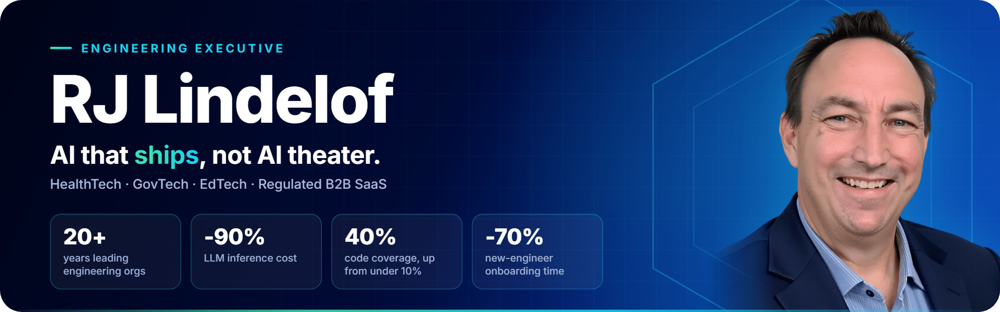</a>

  
  
  
  

**Engineering executive who turns AI from experiment into production SDLC. Builder of high-velocity teams, not manager of large ones.**

:fire: 20+ years scaling SaaS platforms across Healthcare, EdTech, and regulated B2B. 13 years as an IC before management (Java, JavaScript, Node, .NET, Delphi, C++) and I still spin up local dev environments, review PRs, and prototype alongside my teams. Player-coach by conviction, not by title.

:zap: I move AI from pilot to production as a delivery system, not a sandbox toolset. Claude Code, GitHub Copilot, AWS Kiro, and GitHub Actions run as first-class CI/CD stages. Multi-model fluency, no single-vendor dependency. Recent operating indicators from leading SaaS engineering through an AI-native transformation: 5x deploy frequency, 23% PR throughput gain, code coverage from under 10% to 40% with no dedicated QA team, new-engineer onboarding cut 70%.

:shield: Compliance under regulated weight: HIPAA, SOC 2, ISO 27001, HL7/FHIR, Epic EMR integration. Federal-grade reliability shipped to the VA and the White House Medical Unit.

:thumbsup: **Currently in active search.** Targeting VP of Engineering, Head of Engineering, or CTO at a growth-stage company under 250 people, ideally with an engineering team of 15 to 50. Strongest in Healthcare and EdTech SaaS, at home in regulated B2B. Also open to selective fractional CTO and advisory engagements. Let's connect and build. :star2:

## :gem: Engineering Leadership Portfolio

A multi-site network covering leadership philosophy, AI strategy, platform modernization, and consulting.

  <a href="https://rjl.ai/">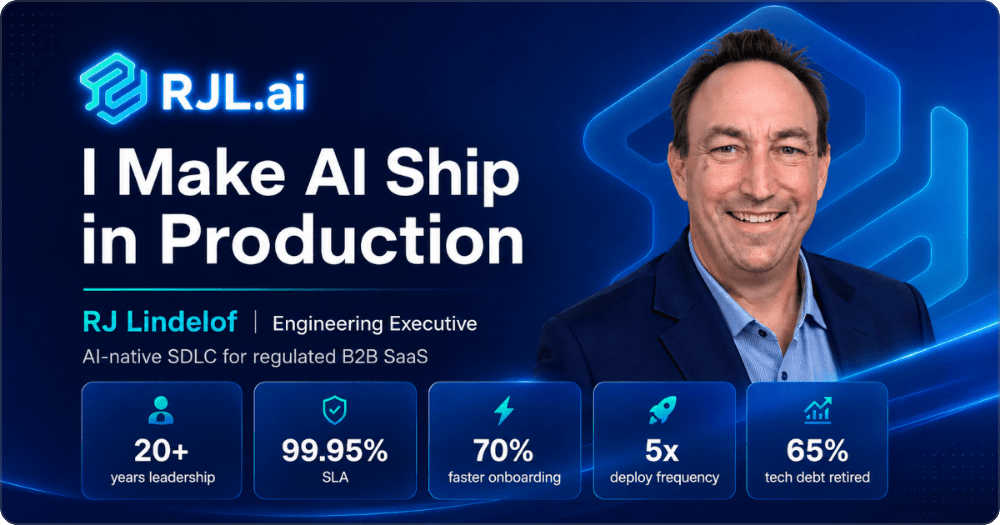</a>
  <a href="https://intentengineering.dev/">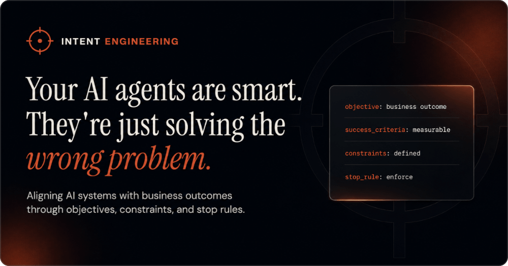</a>
  
  <a href="https://rjl.dev/">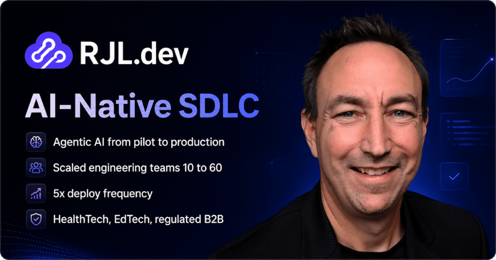</a>
  <a href="https://rjl.guru/">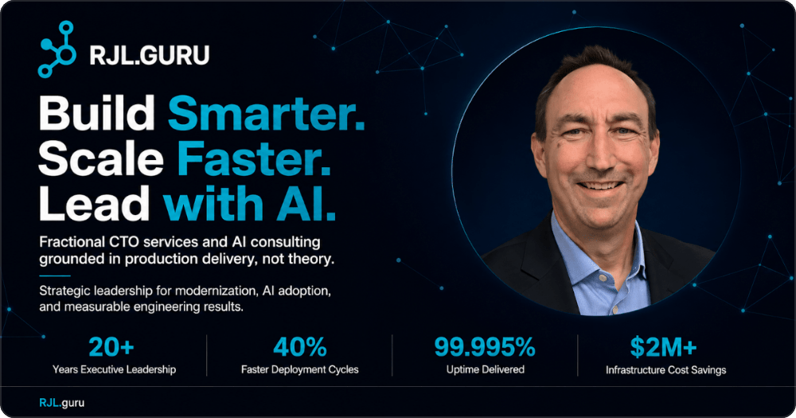</a>
  <a href="https://aidlc.guru/">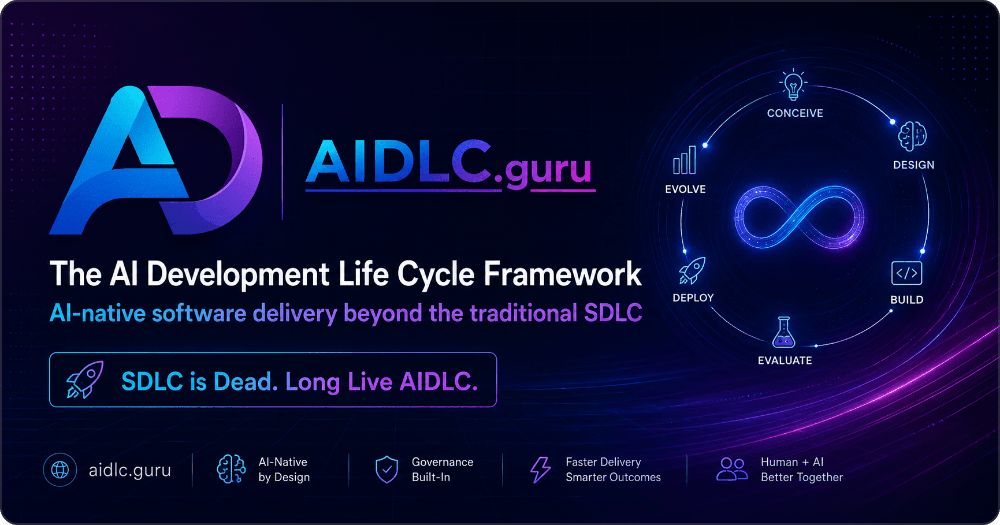</a>

  <a href="https://rjl.ai/">RJL.ai</a> AI across the SDLC &nbsp;|&nbsp;
  <a href="https://intentengineering.dev/">IntentEngineering.dev</a> agents aligned to outcomes &nbsp;|&nbsp;
  <a href="https://rjl.bio/">RJL.bio</a> career arc &nbsp;|&nbsp;
  <a href="https://rjl.dev/">RJL.dev</a> high-performing teams &nbsp;|&nbsp;
  <a href="https://rjl.guru/">RJL.guru</a> fractional CTO &nbsp;|&nbsp;
  <a href="https://aidlc.guru/">AIDLC.guru</a> the AI Development Life Cycle
   
  Also: <a href="https://rjl.ninja/">RJL.ninja</a> tech stacks, databases, and multi-cloud (because every developer wants to be a ninja)

## :books: Tech Journey

My long-form guide to AI-native development: Claude Code, agentic workflows, MCP, context and intent engineering, evals, and the production patterns that make AI actually ship. Click the image to start reading.

## :hammer_and_wrench: Tools, References & Technology

Hands-on output keeps the leadership honest.

  <a href="https://rjl.io/">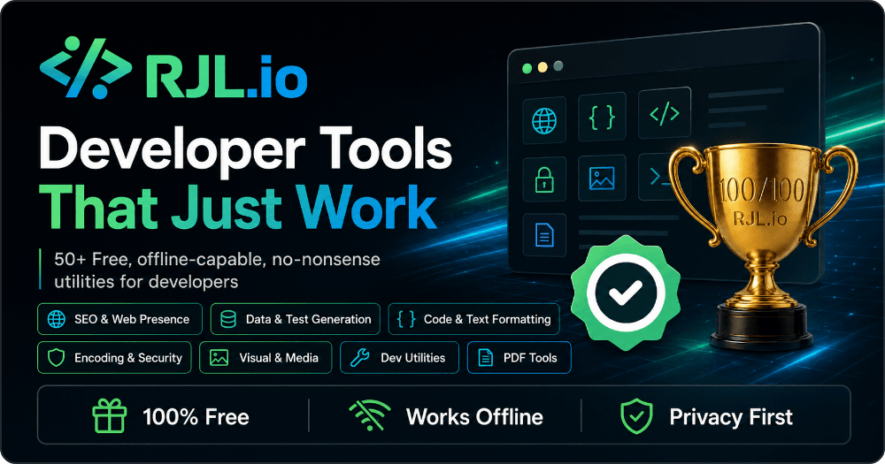</a>
  <a href="https://github.com/rjlsoftware/RJLCustom404">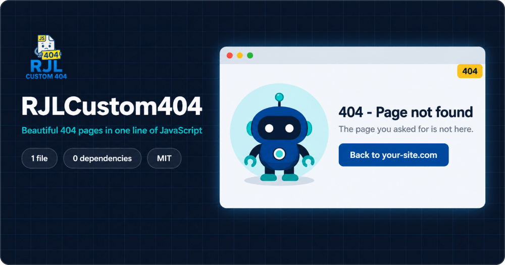</a>

  <a href="https://nowutc.com/">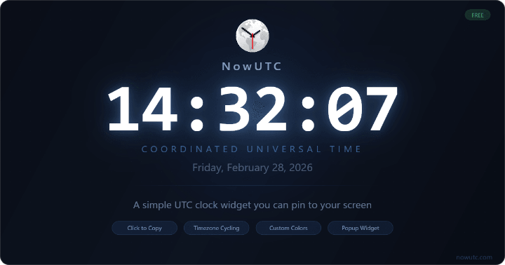</a>
  <a href="https://oldclock.digital/">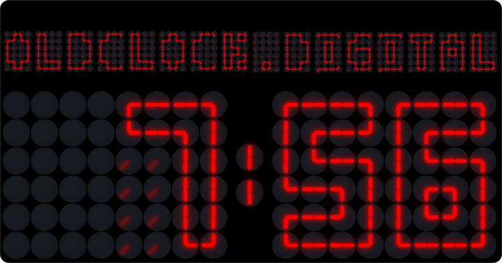</a>
  <a href="https://asciilogo.com/">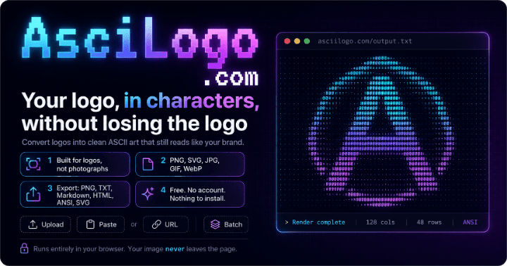</a>
  <a href="https://esmodules.com/">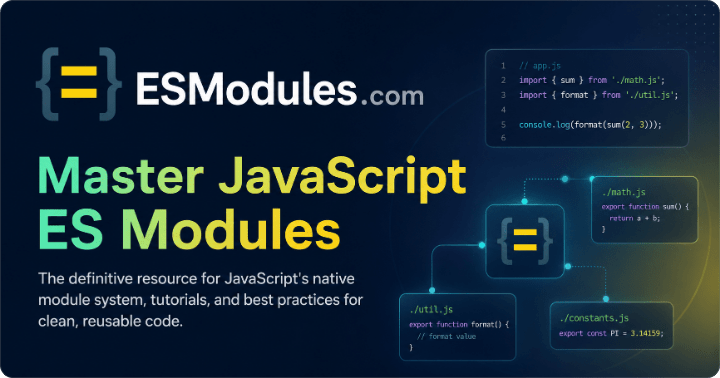</a>
  <a href="https://jsonl.rest/">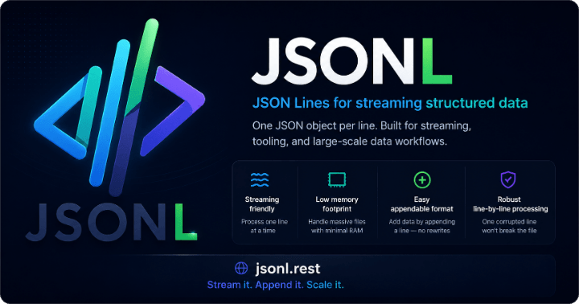</a>
  <a href="https://json5.dev/">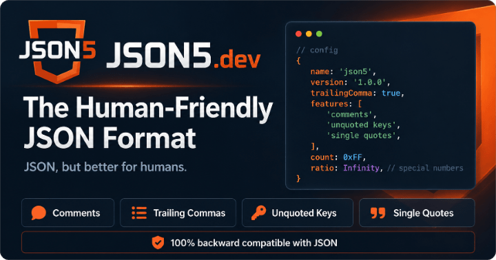</a>
  <a href="https://newstack.dev/">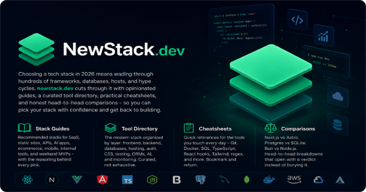</a>
  <a href="https://newstack.ai/">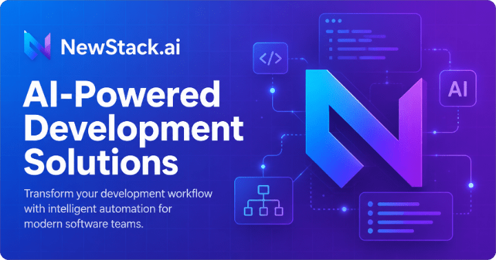</a>
  <a href="https://techdebt.guru/">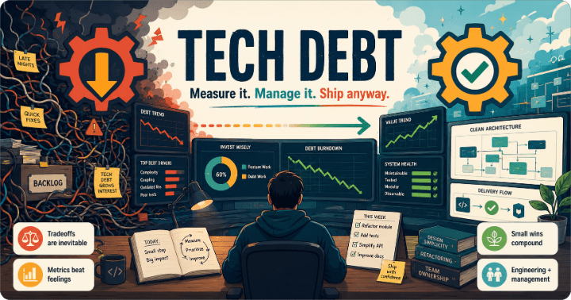</a>

  <a href="https://github.com/rjlsoftware/RJLCustom404">RJLCustom404</a> docs at <a href="https://rjl.codes/">RJL.codes</a> (MIT)
   
  Also: <a href="https://aicoaster.dev/">AICoaster.dev</a> a pixel-art ride through learning AI &nbsp;|&nbsp;
  <a href="https://infragap.com/">InfraGap.com</a> dev workstations built for AI agents &nbsp;|&nbsp;
  <a href="https://wi.golf/">Wi.golf</a> Wisconsin golf &nbsp;|&nbsp;
  <a href="https://localevents.dog/">LocalEvents.dog</a> dog-friendly local events

## :rofl: Humor & Parody Projects

Shipping serious software does not require taking yourself seriously. :joy:

  <a href="https://rjl.sh/">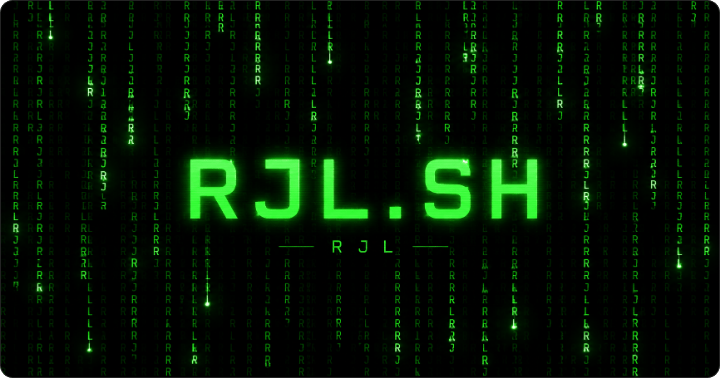</a>
  <a href="https://squirrelstack.dev/">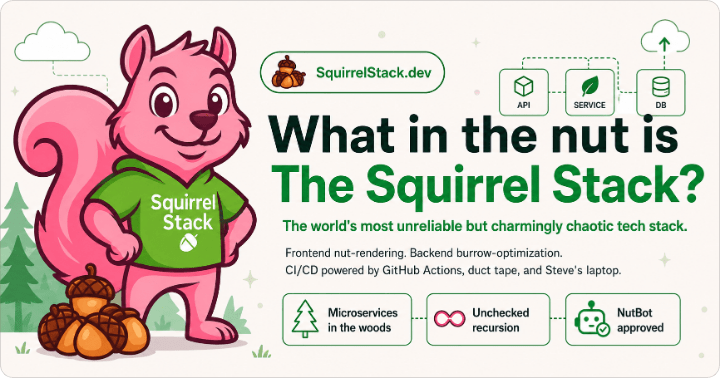</a>
  <a href="https://waterfallconf.com/">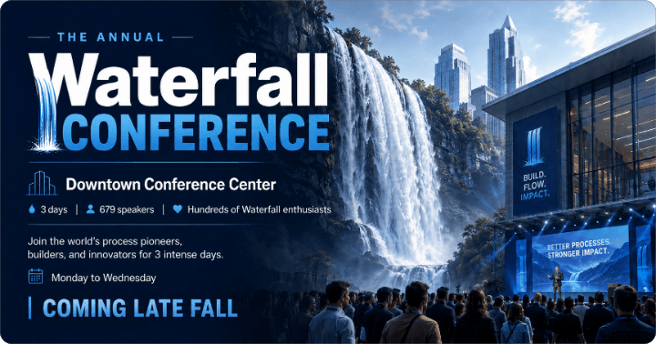</a>
  <a href="https://costlymeeting.com/">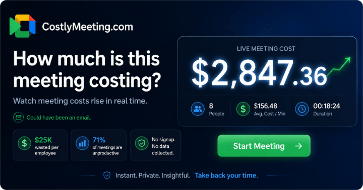</a>
  <a href="https://bestjob.work/">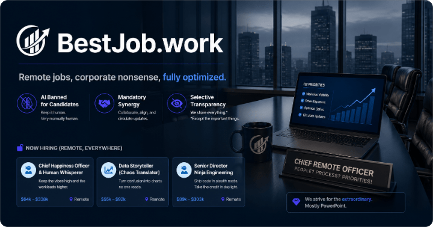</a>
  <a href="https://thisisalongwebsitename.fyi/">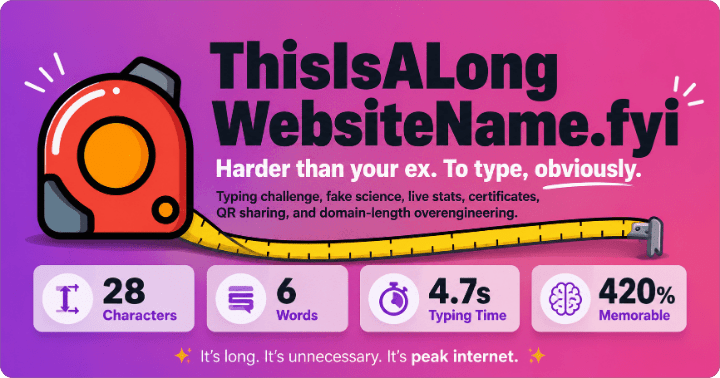</a>
  <a href="https://jimmyketchup.com/">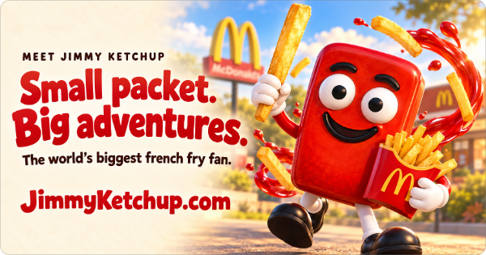</a>
  <a href="https://fakenewsmaker.com/">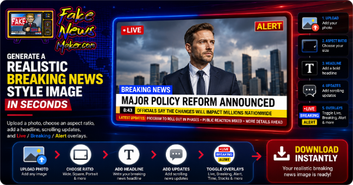</a>
  <a href="https://gen2.at/">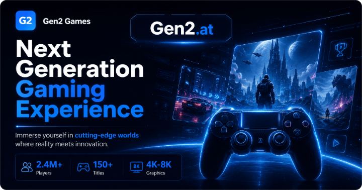</a>

  Customize your own <a href="https://annualconf.com/reset/">crazy conference</a>
   
  Also: <a href="https://halfgan.com/">HalfGAN.com</a> &nbsp;|&nbsp;
  <a href="https://pranksstore.com/">PranksStore.com</a>

---

  <a href="https://www.linkedin.com/in/rjlindelof/">Let's connect on LinkedIn</a> &nbsp;|&nbsp; <a href="https://rjl.link/">Every project on one page at RJL.link</a>

